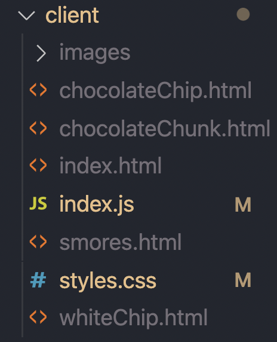
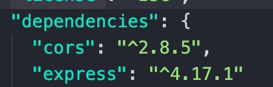
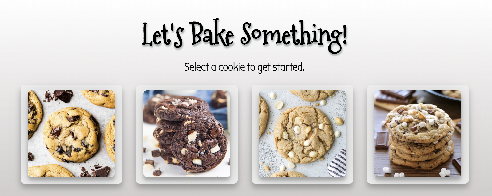
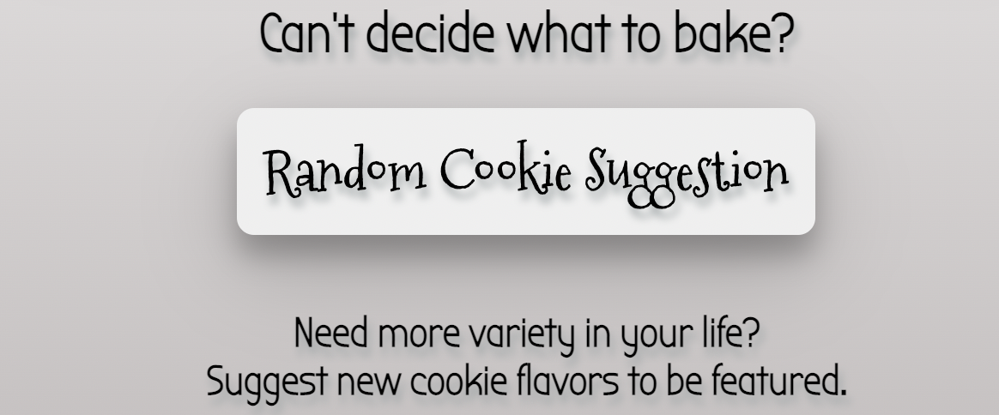
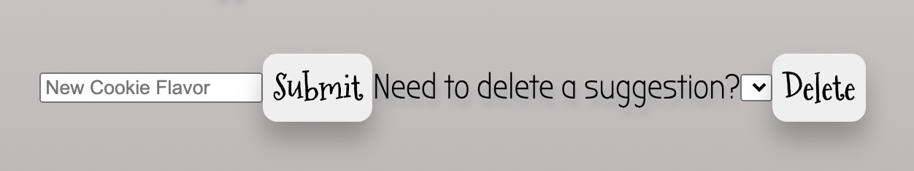
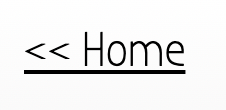

# Foundations-Final-Project

This website is for cookie lovers and hosts tried and true recipes.
This pages uses a combination of JavaScript, HTML and CSS styling. 
Front end code will be located in the client folder.

Back end code will be located in the server folder. 

This site requires Express, Cors and utilizes Axios calls.
Be sure to run npm i express cors for full functionality and compatability. 

At the home page, you will find my favorite cookies featured. Chocolate Chip, Triple Chocolate Chunk, White Chip Macadamia Nut and S'mores. 
Each photo doubles as a button and will redirect users to a new page with a recipe to the corresponding cookie. 
I added in hover styling over the photo buttons to make the interface more apparent and user friendly.

If the user already knows what they want to bake, they can click a selection and will be redirected.
If not, they can utilize the random recipe generator and the javascript function uses math.random to generate a randomized cookie suggestion at the top of the page.

The home page also also allows users to offer suggestions via the input box and submit button. 
Delete functionality is offered as well.

On each of the individual cookie pages two columns are used in HTML and css styling to make the page organized, easy to read and user friendly. 
Users will be able to rate the recipe as well. Rating stars allow for changes to colors, amount and moves with the mouseover. 

Each cookie recipe page is designed with the same style. Giving this site a simplistic yet warm charm.
From each page users, can navigate back to the homepage and try a new recipe or check out the other cookie options.

